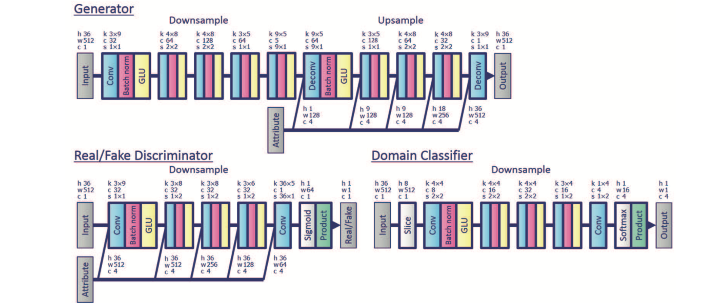

## StarGAN Voice Conversion

This is a tensorflow implementation of the paper: [StarGAN-VC: Non-parallel many-to-many voice conversion with star generative adversarial networks](https://arxiv.org/abs/1806.02169).


**The converted voice examples are in *converted* directory**

## Dependencies

- Python 3.6 (or higher)
- tensorflow 1.8
- librosa 
- pyworld 
- tensorboard
- scikit-learn

> NOTE:According to some feedbacks, we recommend to use tensorflow version 1.8  exactly. (Tensorflow 1.11 generate nonsense results)

## Usage

#### Download dataset

Download the vcc 2016 dataset to the current directory and create `train directory` and `test directory`.

```
python download.py --datasets vcc2016 --train_dir ./data/fourspeakers --test_dir ./data/fourspeakers_test

For simplicity use:
python download.py 
```

The downloaded zip files are extracted to `./data/vcc2016_training` and `./data/evaluation_all`.

1. **training set:** In the experiment, we choose **four speakers** from `./data/vcc2016_training`.  We  move the corresponding folder(eg. SF1,SF2,TM1,TM2 ) to `./data/fourspeakers`.
2. **testing set** In the experiment, we choose **four speakers** from `./data/evaluation_all`.  We  move the corresponding folder(eg. SF1,SF2,TM1,TM2 ) to `./data/fourspeakers_test`.

The data directory now looks like this:

```
data
├── fourspeakers  (training set)
│   ├── SF1
│   ├── SF2
│   ├── TM1
│   └── TM2
├── fourspeakers_test (testing set)
│   ├── SF1
│   ├── SF2
│   ├── TM1
│   └── TM2
├── vcc2016_training (vcc 2016 training set)
│   ├── ...
├── evaluation_all (vcc 2016 evaluation set, we use it as testing set)
│   ├── ...
```


#### Preprocess dataset

Extract features (mcep, f0, ap) from each speech clip.  The features are stored as npy files. We also calculate the statistical characteristics for each speaker.

```
python preprocess.py --input_dir ./data/fourspeakers --output_dir ./data/processed --ispad True

For simplicity use:
python preprocess.py
```

This process may take a few minutes !

**Note that test set doesn’t need preprocess.**


#### Train

Read npy files from `processed_dir` to train model and raw wav files from` test_wav_dir` to randomly generate some samples using the model during training.

```
python train.py --processed_dir ./data/processed --test_wav_dir ./data/fourspeakers_test

For simplicity use:
python train.py
```


#### Convert

Restore model from `model_dir`, convert source_speaker’s speech to target_speaker’s speech. The results are strored in `./converted_voices`

```
python convert.py --model_dir ./your_model_dir  --source_speaker SF1 --target_speaker TM1
```


## Summary

The network structure shown as follows:




**Note: Our implementation follows the original paper’s network structure**, while [pytorch StarGAN-VC code](https://github.com/liusongxiang/StarGAN-Voice-Conversion)‘network is different from the paper as it’s classifier shares the Discriminator’s weights. Both ways generate good converted speeches.

## Reference

[CycleGAN-VC code](https://github.com/leimao/Voice_Converter_CycleGAN)

[pytorch StarGAN-VC code](https://github.com/hujinsen/pytorch-StarGAN-VC)

[StarGAN code](https://github.com/taki0112/StarGAN-Tensorflow)

[StarGAN-VC paper](https://arxiv.org/abs/1806.02169)

[StarGAN paper](https://arxiv.org/abs/1806.02169)

[CycleGAN paper](https://arxiv.org/abs/1703.10593v4)

---

If you feel this repo is good, please  **star**  ! 

Your encouragement is my biggest motivation!
